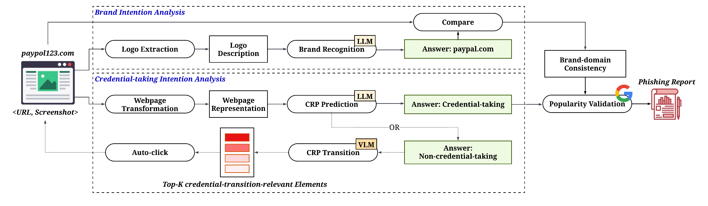

# PhishLLM
Official repository for "Less Defined Knowledge and More True Alarms: Reference-based Phishing Detection without a Pre-defined Reference List".
Published in USENIX Security 2024. 

<p align="center">

  • <a href="https://www.usenix.org/system/files/usenixsecurity24-liu-ruofan.pdf">Read our Paper</a> •

  • <a href="https://sites.google.com/view/phishllm">Visit our Website</a> •

  • <a href="https://sites.google.com/view/phishllm/experimental-setup-datasets?authuser=0#h.r0fy4h1fw7mq">Download our Datasets</a>  •

  • <a href="#citation">Cite our Paper</a> •

</p>

## Introduction
Existing reference-based phishing detection:

- :x: Relies on a pre-defined reference list, which is lack of comprehensiveness and incurs high maintenance cost 
- :x: Does not fully make use of the textual semantics present on the webpage

In our PhishLLM, we build a reference-based phishing detection framework:

- ✅ **Without the pre-defined reference list**: Modern LLMs have encoded far more extensive brand-domain information than any predefined list
- ✅ **Chain-of-thought credential-taking prediction**: Reasoning the credential-taking status in a step-by-step way by looking at the text

## Framework


```Input```: a URL and its screenshot, ```Output```: Phish/Benign, Phishing target

- **Step 1: Brand recognition model**
  - Input: Logo caption, Logo OCR Results
  - Intermediate Output: LLM's predicted brand
  - Output: Validated predicted brand, confirmed through Google Images
  
- **Step 2: Credential-Requiring-Page classification model**
  - Input: Webpage OCR results
  - Output: LLM chooses from A. Credential-Taking Page or B. Non-Credential-Taking Page
  - Go to step 4 if LLM chooses 'A', otherwise go to step 3.
  
- **Step 3: Credential-Requiring-Page transition model (activates if LLM chooses 'B' from the last step)**
  - Input: All clickable UI elements
  - Intermediate Output: Top-1 most likely login UI
  - Output: Webpage after clicking that UI, **go back to Step 1** with the updated webpage and URL

- **Step 4: Output step** 
  - _Case 1_: If the domain is from a web hosting domain: it is flagged as **phishing** if
    (i) LLM predicts a targeted brand inconsistent with the webpage's domain
  and  (ii) LLM chooses 'A' from Step 2
  
  - _Case 2_: If the domain is not from a web hosting domain: it is flagged as **phishing** if
  (i) LLM predicts a targeted brand inconsistent with the webpage's domain
  (ii) LLM chooses 'A' from Step 2
  and (iii) the domain is not a popular domain indexed by Google
  
  - _Otherwise_: reported as **benign**

## Project structure

<pre>
scripts/ 
├── infer/
│   └──test.py             # inference script
├── train/
│   └──train.py             # training script for the CRP transition model (a CLIP model)
├── pipeline/             
│   └──test_llm.py # TestLLM class
├── data/ # data utilities
└── utils/ # other utitiles such as web interaction utility functions 

experiments/
├── ablation_study/ # ablation study in RQ2 and public phishing study in RQ4
├── componentwise_evaluation/ # component-wise evaluation experiments in RQ2, RQ3
└── field_study/ # Large/Small-scale field study in RQ4

prompts/ 
├── brand_recog_prompt.json 
└── crp_pred_prompt.json

server/ # deployment scripts to deploy PhishLLM demo website
</pre>

## Setup
- Step 1: Clone the Repository and **Install Requirements**. A new conda environment "phishllm" will be created
```bash
    cd PhishLLM/
    chmod +x ./setup.sh
    export ENV_NAME="phishllm" && ./setup.sh
```
- Step 2: Register **OpenAI API Key**, [See Tutorial here](https://platform.openai.com/docs/quickstart). Paste the API key to './datasets/openai_key.txt'.


- Step 3: Register a **Google Programmable Search API Key**, [See Tutorial here](https://meta.discourse.org/t/google-search-for-discourse-ai-programmable-search-engine-and-custom-search-api/307107). Paste your API Key (in the first line) and Search Engine ID (in the second line) to "./datasets/google_api_key.txt":
     ```text 
      [API_KEY]
      [SEARCH_ENGINE_ID]
     ```
    
- Step 4 (Optional): Edit **Hyperparameters**. All hyperparameter configurations are in [param_dict.yaml](param_dict.yaml). 

## Prepare the Dataset
To test on your own dataset, you need to prepare the dataset in the following structure:
<pre>
testing_dir/
├── aaa.com/
│   ├── shot.png  # save the webpage screenshot
│   ├── info.txt  # save the webpage URL
│   └── html.txt  # save the webpage HTML source
├── bbb.com/
│   ├── shot.png  # save the webpage screenshot
│   ├── info.txt  # save the webpage URL
│   └── html.txt  # save the webpage HTML source
├── ccc.com/
│   ├── shot.png  # save the webpage screenshot
│   ├── info.txt  # save the webpage URL
│   └── html.txt  # save the webpage HTML source
</pre>


## Inference: Run PhishLLM 
```bash
  conda activate phishllm
  python -m scripts.infer.test --folder [folder to test, e.g., ./testing_dir]
```

## Understand the Output
- You will see the console is printing logs like the following <details><summary> Expand to see the sample log</summary>
  <pre><code>
    [PhishLLMLogger][DEBUG] Folder ./datasets/field_study/2023-09-01/device-862044b2-5124-4735-b6d5-f114eea4a232.remotewd.com
    [PhishLLMLogger][DEBUG] Logo caption: the logo for sonicwall network security appliance
    [PhishLLMLogger][DEBUG] Logo OCR: SONICWALL Network Security Appliance Username
    [PhishLLMLogger][DEBUG] Industry: Technology
    [PhishLLMLogger][DEBUG] LLM prediction time: 0.9699530601501465
    [PhishLLMLogger][DEBUG] Detected brand: sonicwall.com
    [PhishLLMLogger][DEBUG] Domain sonicwall.com is valid and alive
    [PhishLLMLogger][DEBUG] CRP prediction: There is no confusing token. Then we find the keywords that are related to login: LOG IN. Additionally, the presence of "Username" suggests that this page requires credentials. Therefore, the answer would be A.
    [💥] Phishing discovered, phishing target is sonicwall.com
    [PhishLLMLogger][DEBUG] Folder ./datasets/field_study/2023-09-01/lp.aldooliveira.com
    [PhishLLMLogger][DEBUG] Logo caption: a black and white photo of the word hello world
    [PhishLLMLogger][DEBUG] Logo OCR: Hello world! Welcome to WordPress. This is your first post. Edit or delete it, then start writing! dezembro 2, 2021 publicado
    [PhishLLMLogger][DEBUG] Industry: Uncategorized
    [PhishLLMLogger][DEBUG] LLM prediction time: 0.8813009262084961
    [PhishLLMLogger][DEBUG] Detected brand: wordpress.com
    [PhishLLMLogger][DEBUG] Domain wordpress.com is valid and alive
    [PhishLLMLogger][DEBUG] CRP prediction: There is no token or keyword related to login or sensitive information. Therefore the answer would be B.
    [PhishLLMLogger][DEBUG] No candidate login button to click
     [✅] Benign
  </code></pre></details>
  
- Meanwhile, a txt file named "[today's date]_phishllm.txt" is being created, it has the following columns: 
  - "folder": name of the folder
  - "phish_prediction": "phish" | "benign"
  - "target_prediction": phishing target brand's domain, e.g. paypal.com, meta.com
  - "brand_recog_time": time taken for brand recognition
  - "crp_prediction_time": time taken for CRP prediction
  - "crp_transition_time": time taken for CRP transition

## (Optional) Re-training

Alternatively, if you would like to re-train the CRP transition model, which is a CLIP model. We have annotated a dataset for login UI / non-login UI elements.
- First download the dataset from here: https://drive.google.com/file/d/1uRK7ebJ0z1_R7kG2QcDf2rAeMK50fTi0/view?usp=share_link. Put all files under ./datasets/
- Start training:
  ```bash
    conda activate phishllm
    python -m scripts.train.train --epoch 5 --batch_size 128 --lr 0.00001 --annot_path ./datasets/alexa_login_train.txt --dataset_root ./datasets/alexa_login
  ```
  
## (Optional) Use other versions of GPT

You can change the GPT model you want to use in the ``LLM_model`` argument in [param_dict.yaml](param_dict.yaml), default is "gpt-3.5-turbo-16k".
Please check the [list of GPT models](https://platform.openai.com/docs/models) you can use.

## Citations
```bibtex
@inproceedings{liu2024less,
  title={Less Defined Knowledge and More True Alarms: Reference-based Phishing Detection without a Pre-defined Reference List},
  author={Liu, Ruofan and Lin, Yun and Teoh, Xiwen and Liu, Gongshen and Huang, Zhiyong and Dong, Jin Song},
  booktitle={33rd USENIX Security Symposium (USENIX Security 24)},
  pages={523--540},
  year={2024}
}
```
If you have any issues running our code, you can raise a Github issue or email us [liu.ruofan16@u.nus.edu, lin_yun@sjtu.edu.cn, dcsdjs@nus.edu.sg](mailto:liu.ruofan16@u.nus.edu,lin_yun@sjtu.edu.cn,dcsdjs@nus.edu.sg)
