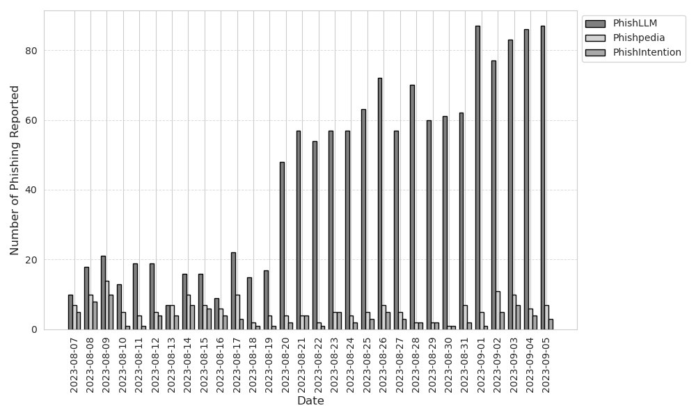
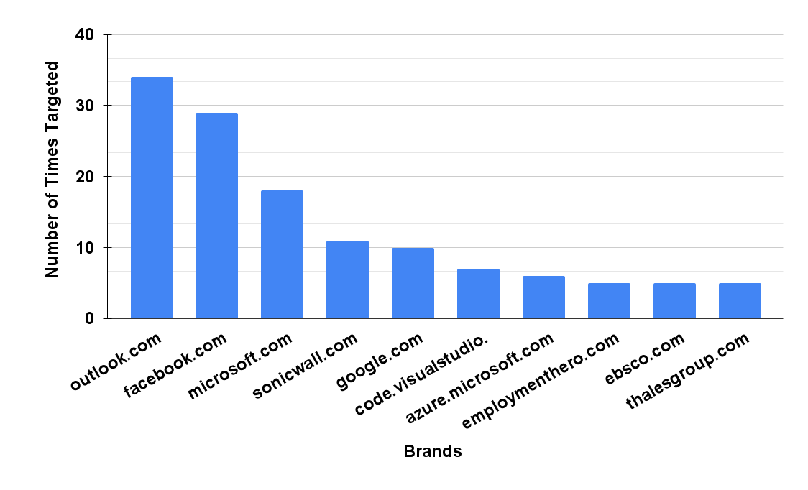

# PhishLLM

[//]: # (<p align="center">)

[//]: # (  • <a href="">Paper</a> •)

[//]: # (  <a href="">Website</a> •)

[//]: # (  <a href="https://drive.google.com/drive/folders/1x6N6QEt_34B-pMStbBANUrjim-2ixG6T?usp=sharing">Datasets</a>  •)

[//]: # (  <a href="#citation">Citation</a> •)

[//]: # (</p>)

## Introductions
Existing reference-based phishing detection
- :x: Rely on a pre-defined reference list
- :x: Necessitate a massive amount of high-quality, diverse annotated data
- :x: Do not fully utilize the textual information present on the webpage

In our PhishLLM, we build a reference-based phishing detection framework
- ✅ Without a pre-defined reference list
- ✅ Requires light-weight training
- ✅ Fully explainable, since it mirrors human cognitive process during web interaction, provides natural laguagne explanations at every step 

## Framework


- Step 1: Brand Recognition Model to predict the targeted brand
  - Input: Logo Caption, Logo OCR results, Industry sector (optional)
  - Intermediate output: LLM's predicted brand
  - Output: Validated predicted brand, validated through Google Images
- Step 2: Credential-requiring-page Classification Model 
  - Input: Webpage OCR results
  - Output: LLM chooses from A. credential-taking page B. non-credential-taking page
- Step 3.1 Ranking Model (Activate if LLM chooses B from last step): 
  - Input: Webpage clickable UI elements (the webpage must be alive)
  - Intermediate output: The most likely UI being a login button
  - Output: The page after clicking the UI
- Step 3.2: Termination
  - Phishing alarm will be raised if 
    - LLM predicts a targeted brand that is not consistent with the webpage's domain 
    - **AND** the LLM chooses A from step 2
  - Benign decision will be reached if 
    - LLM cannot predict a targeted brand
    - **OR** the targeted brand aligns with the webpage domain
    - **OR** the LLM consistently chooses B even after running step 3.1 for multiple times.

## Project structure
```
|_ brand_recognition
|_ selection_model (i.e. credential-requiring-page classification model)
|_ ranking_model
|_ model_chain (chaining all the components)
  |_ test_llm.py: main class
|_ field_study 
   |_ test.py: main script
```

## Setup
- Step 1: Clone this repository, and install requirements
```bash
    cd PhishLLM/
    chmod +x ./setup.sh
    ./setup.sh
```
- Step 2: Register openai API key: See https://platform.openai.com/. Save the API key to './datasets/openai_key2.txt'
- Step 3: Create a [google cloud service account](https://console.cloud.google.com/), set the billing details
  - Create a project, enable "Custom Search API"
  - For "Custom Search API", get the API Key and Search Engine ID following this [guide](https://developers.google.com/custom-search/v1/overview).
  - Create a blank txt file in the directory "./datasets/google_api_key.txt", copy and paste your API Key and Search Engine ID into the txt file like the following:
     ```text 
      [YOUR_API_KEY]
      [YOUR_SEARCH_ENGINE_ID]
     ```
- Step 4 (Optional): All hyperparameter configurations are stored in param_dict.yaml, e.g. the parameters for GPT, the threshold for OCR etc. 
Please edit the file if you want to play with different combinations of parameters.
- Step 5: Run!
```bash
    conda activate myenv
    python -m field_study.test --folder [folder to test, e.g. ./datasets/field_study/2023-08-21/] --date [e.g. 2023-08-21]
```

<details>
<summary> A .log file will be created during the run, which will log the explanations for each model prediction, click to see the sampled log</summary>
    <pre><code>
      [PhishLLMLogger][DEBUG] Folder ./datasets/field_study/2023-09-01/device-862044b2-5124-4735-b6d5-f114eea4a232.remotewd.com
      [PhishLLMLogger][DEBUG] Logo caption: the logo for sonicwall network security appliance
      [PhishLLMLogger][DEBUG] Logo OCR: SONICWALL Network Security Appliance Username
      [PhishLLMLogger][DEBUG] Industry: Technology
      [PhishLLMLogger][DEBUG] LLM prediction time: 0.9699530601501465
      [PhishLLMLogger][DEBUG] Detected brand: sonicwall.com
      [PhishLLMLogger][DEBUG] Domain sonicwall.com is valid and alive
      [PhishLLMLogger][DEBUG] CRP prediction: There is no confusing token. Then we find the keywords that are related to login: LOG IN. Additionally, the presence of "Username" suggests that this page requires credentials. Therefore, the answer would be A.
      [💥] Phishing discovered, phishing target is sonicwall.com
      [PhishLLMLogger][DEBUG] Folder ./datasets/field_study/2023-09-01/lp.aldooliveira.com
      [PhishLLMLogger][DEBUG] Logo caption: a black and white photo of the word hello world
      [PhishLLMLogger][DEBUG] Logo OCR: Hello world! Welcome to WordPress. This is your first post. Edit or delete it, then start writing! dezembro 2, 2021 publicado
      [PhishLLMLogger][DEBUG] Industry: Uncategorized
      [PhishLLMLogger][DEBUG] LLM prediction time: 0.8813009262084961
      [PhishLLMLogger][DEBUG] Detected brand: wordpress.com
      [PhishLLMLogger][DEBUG] Domain wordpress.com is valid and alive
      [PhishLLMLogger][DEBUG] CRP prediction: There is no token or keyword related to login or sensitive information. Therefore the answer would be B.
      [PhishLLMLogger][DEBUG] No candidate login button to click
       [✅] Benign
    </code></pre>
</details>

## Findings
<details>
  <summary>Number of phishing caught</summary>
  
</details>
<details>
  <summary>Phishing domain age distribution</summary>
  
</details>
<details>
  <summary>Phishing domain TLD distribution</summary>
  
  | Top-5 TLD | Frequency      |
  |----------------| --------------- |
  | .com | 447 occurrences |
  | .de | 60 occurrences |
  | .online | 58 occurrences |
  | .info | 52 occurrences |
  | .xyz | 52 occurrences |

</details>
<details>
  <summary>Top phishing targets, and top targeted sectors</summary>
  
  
</details>
<details>
  <summary>Geolocations of phishing IPs</summary>
  
</details>
<details>
  <summary>Phishing campaign analysis</summary>
  
</details>


## Updates
- [👏2023-09-07] Pack up the phishing websites reported from field study: [link](https://drive.google.com/file/d/1WsUmqq29-f8PoBj0YNgWcv4XryOXfFfv/view?usp=sharing).
- [🛠️2023-08-28] Add functions to judge whether the webpage state has been updated or not (the best way is to check webpage screenshot, not the URL)
- [🛠️2023-08-28] Update the CRP transition logic, if the webpage state hasn't been updated, we shall try to click lower ranked buttons, instead of keeping clicking the Top-1 button
- [🤔2023-08-27] We find supplying the industry sector to the brand recognition model can further improve the brand recognition capabilities, without affecting the robustness.
- [🤔2023-08-24] A relaxed result validation is to check whether predicted domain is alive, added this as an option.
- [🛠️2023-08-20] Modify the brand recognition model.
- [🛠️2023-08-07] To prevent PhishLLM to report brands that are offering cloud services (e.g. domain hosting, web hosting etc.), we keep a list of those domains [./datasets/hosting_blacklists.txt](./datasets/hosting_blacklists.txt), this list will be keep growing.

