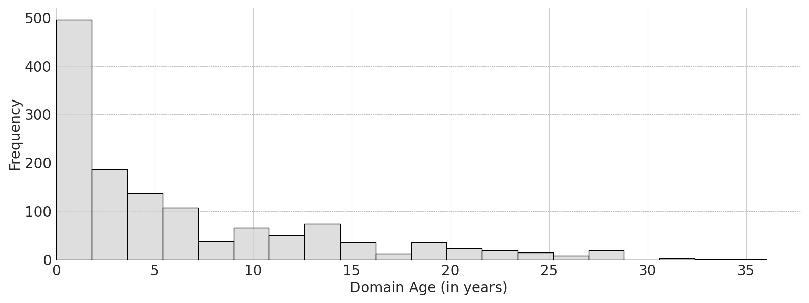
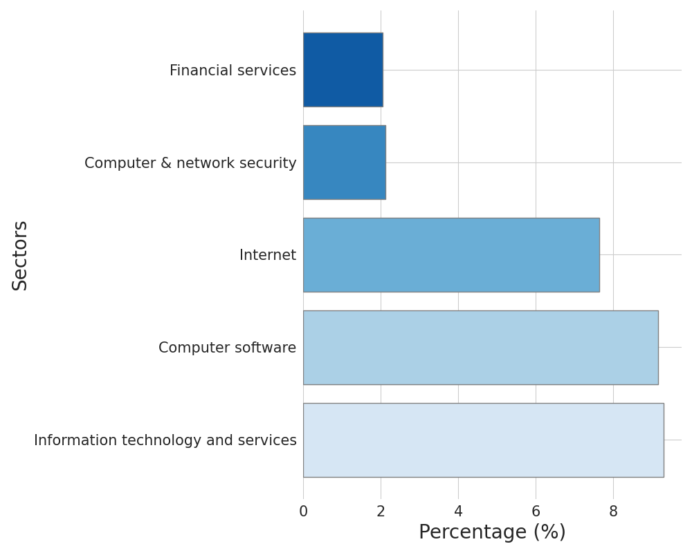

# PhishLLM

<p align="center">
  • <a href="">Paper</a> •
  <a href="">Website</a> •
  <a href="https://drive.google.com/drive/folders/1x6N6QEt_34B-pMStbBANUrjim-2ixG6T?usp=sharing">Datasets</a>  •
  <a href="#citation">Citation</a> •
</p>

## Introductions
Existing reference-based phishing detection
- :x: Rely on a pre-defined reference list
- :x: Necessitate a massive amount of high-quality, diverse annotated data
- :x: Do not fully utilize the textual information present on the webpage

In our PhishLLM, we build a reference-based phishing detection framework
- ✅ Without a pre-defined reference list
- ✅ Requires light-weight training
- ✅ Mirrors human cognitive process during web interaction, therefore provides enhanced explainability 

## Framework


- Step 1: Brand Recognition Model to predict the targeted brand
  - Input: Logo Caption, Logo OCR results, Industry sector (optional)
  - Intermediate output: LLM's predicted brand
  - Output: Validated predicted brand, validated through Google Images
- Step 2: Credential-requiring-page Classification Model 
  - Input: Webpage OCR results
  - Output: LLM chooses from A. credential-taking page B. non-credential-taking page
- Step 3.1 Ranking Model (Activate if LLM chooses B from last step): 
  - Input: Webpage clickable UI elements (the webpage must be alive)
  - Intermediate output: The most likely UI being a login button
  - Output: The page after clicking the UI
- Step 3.2: Termination
  - Phishing alarm will be raised if 
    - LLM predicts a targeted brand that is not consistent with the webpage's domain 
    - **AND** the LLM chooses A from step 2
  - Benign decision will be reached if 
    - LLM cannot predict a targeted brand
    - **OR** the targeted brand aligns with the webpage domain
    - **OR** the LLM consistently chooses B even after running step 3.1 for multiple times.

## Project structure
```
|_ brand_recognition
|_ selection_model (i.e. credential-requiring-page classification model)
|_ ranking_model
|_ model_chain (chaining all the components)
  |_ test_llm.py: main class
|_ field_study 
   |_ test.py: main script
```

## Setup
- Step 1: Clone this repository, and install requirements
```bash
    cd PhishLLM/
    chmod +x ./setup.sh
    ./setup.sh
```
- Step 2: Register openai API key: See https://platform.openai.com/. Save the API key to './datasets/openai_key2.txt'
- Step 3: Run!
```bash
    conda activate myenv
    python -m field_study.test --folder [folder to test, e.g. ./datasets/field_study/2023-08-21/] --date [e.g. 2023-08-21]
```
If you would like to activate results validation for brand recognition model, add the flag "--validate". 
Note that this will improve the phishing report precision but at the same time incur a higher runtime overhead.
```bash
    python -m field_study.test --folder [folder to test] --date [e.g. 2023-08-21] --validate 
```
- All hyperparameter configurations are stored in param_dict.yaml, e.g. the parameters for GPT, the threshold for OCR etc. 
Please edit the file if you want to play with different combinations of parameters.

## Findings
<details>
  <summary>Number of phishing caught</summary>
  
</details>
<details>
  <summary>Phishing domain age distribution</summary>
  
</details>
<details>
  <summary>Phishing domain TLD distribution</summary>

  | Top-5 TLD | Frequency      |
  |----------------| --------------- |
  | .com    | 256 occurrences |
  | .de   | 39 occurrences |
  | .info    | 31 occurrences |
  | .online    |  30 occurrences |
  | .net    | 30 occurrences |

</details>
<details>
  <summary>Top phishing targets, and top targeted sectors</summary>
  
  
</details>
<details>
  <summary>Geolocations of phishing IPs</summary>
  
</details>
<details>
  <summary>Phishing campaign analysis</summary>
  
</details>


## Updates
- [🤔2023-08-27] We find supplying the industry sector to the brand recognition model can further improve the brand recognition capabilities, without affecting the robustness.
- [🤔2023-08-24] A relaxed result validation is to check whether predicted domain is alive, added this as an option.
- [🛠️2023-08-20] Modify the brand recognition model.
- [🛠️2023-08-07] To prevent PhishLLM to report brands that are offering cloud services (e.g. domain hosting, web hosting etc.), we keep a list of those domains [./datasets/hosting_blacklists.txt](./datasets/hosting_blacklists.txt), this list will be keep growing.

