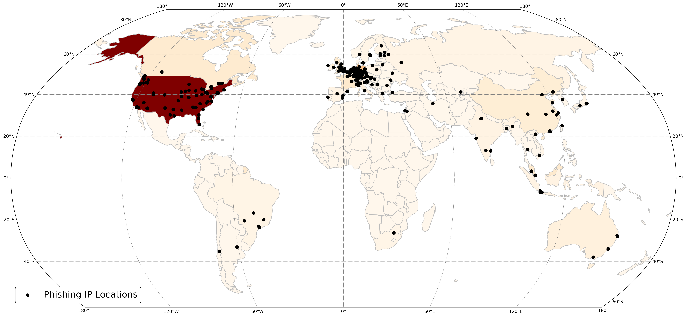
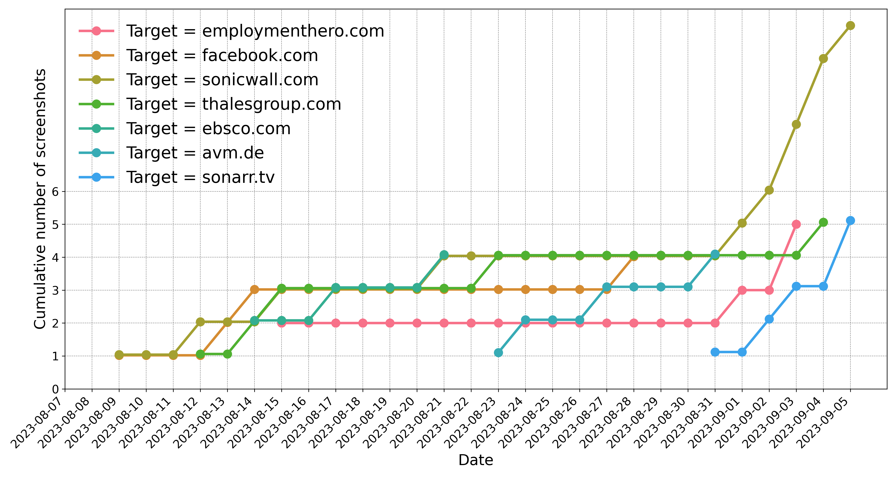

# PhishLLM

<p align="center">

[//]: # (  • <a href="">Paper</a> •)

[//]: # (  • <a href="">Website</a> •)

[//]: # (  • <a href="https://drive.google.com/drive/folders/1x6N6QEt_34B-pMStbBANUrjim-2ixG6T?usp=sharing">Datasets</a>  •)

[//]: # (  • <a href="#citation">Citation</a> •)

</p>

## Introduction
Existing reference-based phishing detection:

- :x: Relies on a pre-defined reference list
- :x: Does not fully utilize the textual information present on the webpage

In our PhishLLM, we build a reference-based phishing detection framework:

- ✅ Without a pre-defined reference list
- ✅ Fully explainable, as it mirrors the human cognitive process during web interaction and provides natural language explanations at every step

## Framework


- Step 1: Brand recognition model
  - Input: logo caption, Logo OCR Results, industry sector (optional)
  - Intermediate Output: LLM's predicted brand
  - Output: Validated predicted brand, confirmed through Google Images
  
- Step 2: Credential-Requiring-Page classification model
  - Input: webpage OCR results
  - Output: LLM chooses from A. Credential-Taking Page or B. Non-Credential-Taking Page
  
- Step 3.1: CRP transition model (activate if LLM chooses 'B' from the last step)
  - Input: webpage clickable UI elements (the webpage must be live)
  - Intermediate Output: most likely UI element being a login button
  - Output: The page after clicking the UI 
  
- Step 3.2: 
  - Case 1: If the domain is from a web hosting domain: it is flagged as phishing if
    (i) LLM predicts a targeted brand inconsistent with the webpage's domain
  and  (ii) LLM chooses 'A' from Step 2
  
  - Case 2: If the domain is not from a web hosting domain: it is flagged as phishing if
  (i) LLM predicts a targeted brand inconsistent with the webpage's domain
  (ii) LLM chooses 'A' from Step 2
  and (iii) the domain is not a popular domain indexed by Google

## Project structure
```
|_ brand_recognition
|_ selection_model (i.e. credential-requiring-page classification model)
|_ ranking_model
|_ model_chain (chaining all the components)
  |_ test_llm.py: main class
|_ field_study 
   |_ test.py: main script
```

## Setup
- Step 1: Clone the Repository and Install Requirements
```bash
    cd PhishLLM/
    chmod +x ./setup.sh
    ./setup.sh
```
- Step 2: Register OpenAI API Key. See [OpenAI Official Docs](https://platform.openai.com/). Save the API key to './datasets/openai_key2.txt'.
- Step 3: Create a Google Cloud Service Account
  - Go to [Google Cloud Console]((https://console.cloud.google.com/)) and set up billing details.
  - Create a project and enable the "Custom Search API".
  - Obtain the API Key and Search Engine ID for "Custom Search API" following this [guide](https://developers.google.com/custom-search/v1/overview).
  - Create a blank text file in the directory "./datasets/google_api_key.txt" and paste your API Key and Search Engine ID as follows:
     ```text 
      [YOUR_API_KEY]
      [YOUR_SEARCH_ENGINE_ID]
     ```
- Step 4 (Optional): Edit Hyperparameters. All hyperparameter configurations are stored in param_dict.yaml. Edit this file to experiment with different parameter combinations.
- Step 5: 
  - Run PhishLLM 
  ```bash
    conda activate myenv
    python -m field_study.test --folder [folder to test, e.g., ./datasets/field_study/2023-08-21/] --date [e.g., 2023-08-21]
  ```
  - Or run baseline methods
  ```bash
    conda activate myenv
    python -m field_study.test_baseline --folder [folder to test] --date [e.g., 2023-08-21] --method [phishpedia|phishintention|dynaphish]
  ```

<details>
<summary> A .log file will be created during the run, which will log the explanations for each model prediction, click to see the sampled log</summary>
    <pre><code>
      [PhishLLMLogger][DEBUG] Folder ./datasets/field_study/2023-09-01/device-862044b2-5124-4735-b6d5-f114eea4a232.remotewd.com
      [PhishLLMLogger][DEBUG] Logo caption: the logo for sonicwall network security appliance
      [PhishLLMLogger][DEBUG] Logo OCR: SONICWALL Network Security Appliance Username
      [PhishLLMLogger][DEBUG] Industry: Technology
      [PhishLLMLogger][DEBUG] LLM prediction time: 0.9699530601501465
      [PhishLLMLogger][DEBUG] Detected brand: sonicwall.com
      [PhishLLMLogger][DEBUG] Domain sonicwall.com is valid and alive
      [PhishLLMLogger][DEBUG] CRP prediction: There is no confusing token. Then we find the keywords that are related to login: LOG IN. Additionally, the presence of "Username" suggests that this page requires credentials. Therefore, the answer would be A.
      [💥] Phishing discovered, phishing target is sonicwall.com
      [PhishLLMLogger][DEBUG] Folder ./datasets/field_study/2023-09-01/lp.aldooliveira.com
      [PhishLLMLogger][DEBUG] Logo caption: a black and white photo of the word hello world
      [PhishLLMLogger][DEBUG] Logo OCR: Hello world! Welcome to WordPress. This is your first post. Edit or delete it, then start writing! dezembro 2, 2021 publicado
      [PhishLLMLogger][DEBUG] Industry: Uncategorized
      [PhishLLMLogger][DEBUG] LLM prediction time: 0.8813009262084961
      [PhishLLMLogger][DEBUG] Detected brand: wordpress.com
      [PhishLLMLogger][DEBUG] Domain wordpress.com is valid and alive
      [PhishLLMLogger][DEBUG] CRP prediction: There is no token or keyword related to login or sensitive information. Therefore the answer would be B.
      [PhishLLMLogger][DEBUG] No candidate login button to click
       [✅] Benign
    </code></pre>
</details>

## Findings
<details>
  <summary>Number of phishing caught</summary>
  
</details>
<details>
  <summary>Top 10 phishing targets</summary>
  
</details>
<details>
  <summary>Geolocations of phishing IPs</summary>
  
</details>
<details>
  <summary>Phishing campaign analysis</summary>
  
</details>

